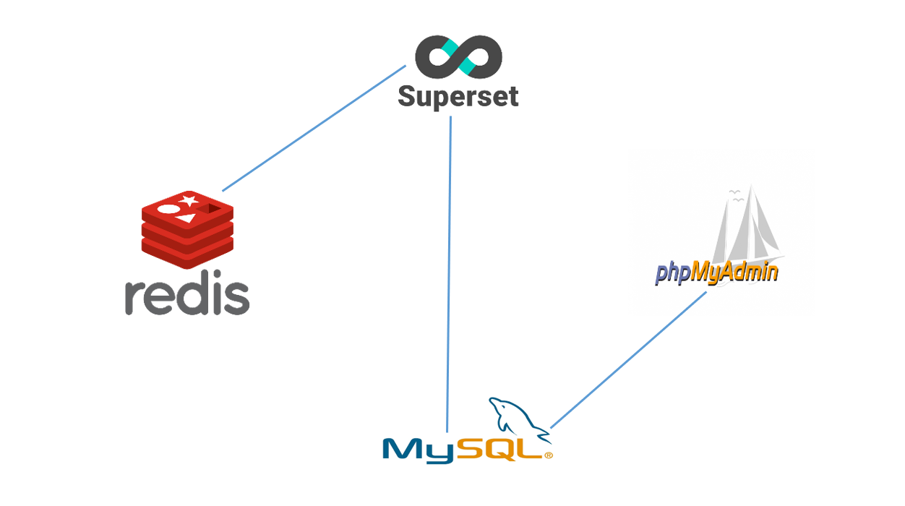
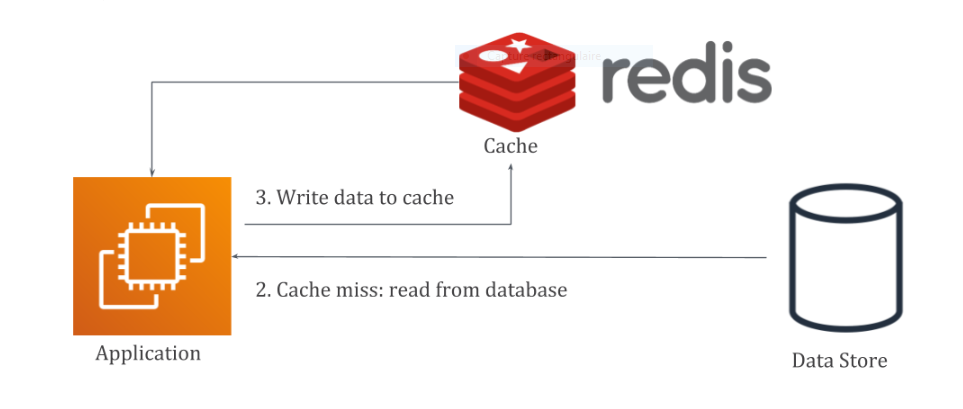
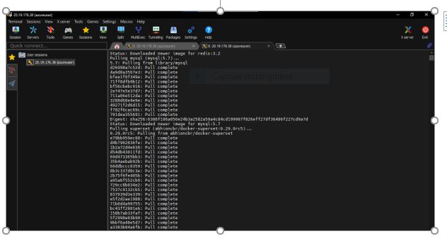
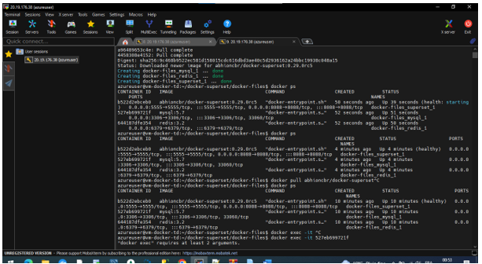
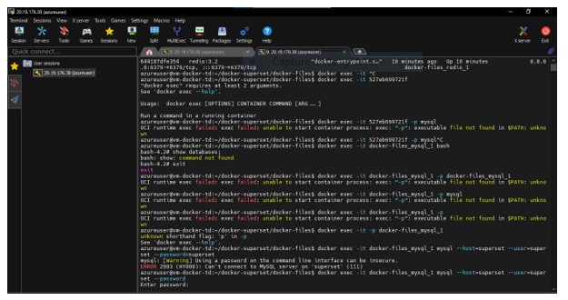
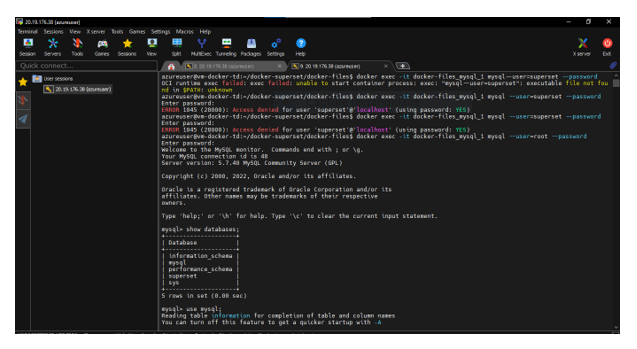
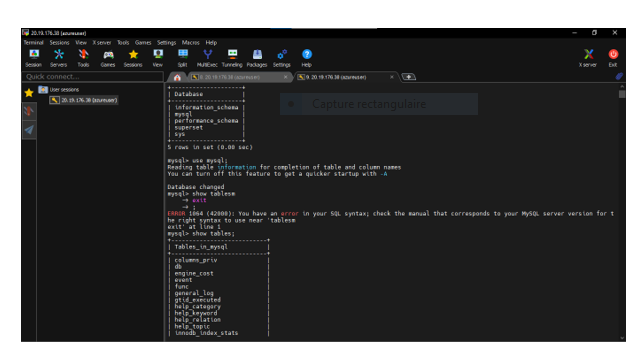
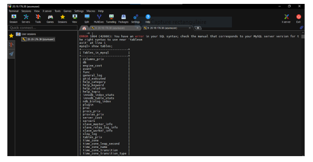
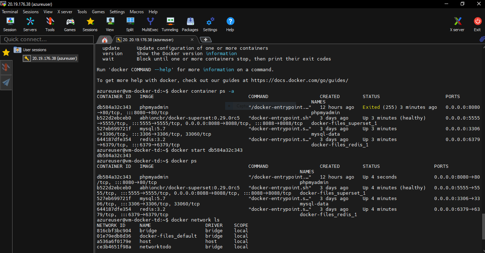
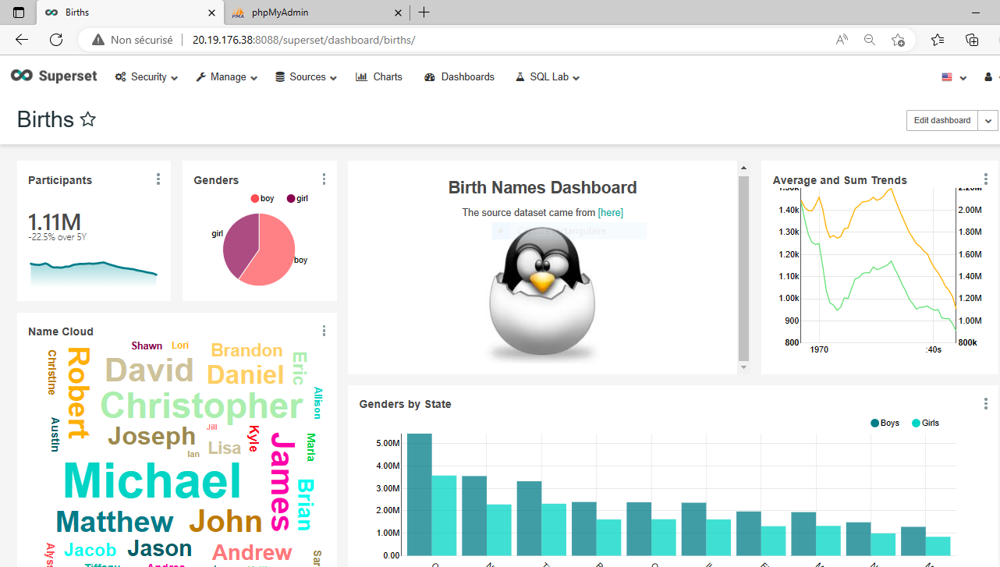

# BI PROJECT - MYSQL - PHPMYADMIN - SUPERSET - Docker - Contenerization

# contributors of the projet
ABDELLAOUI Rachid - LHALOUI Aoulia - BRAKNI Yazid - KANTAPAREDDY Pascal

# INTRODUCTION
 
We imagined ourselves to be a young company that provides turnkey Business Intelligence services via the cloud.
We thought of four main tools to use through docker.
 
MYSQL:
 MySQL is a relational database management system (RDBMS). It is distributed under a dual GPL and proprietary license.
PHPADMIN: 
phpMyAdmin (PMA) is a management Web application for the MySQL and MariaDB database management systems, produced mainly in PHP and distributed under the GNU GPL license.
REDIS:
 Redis is an extensible, very high performance, key-value database management system written in ANSI C and distributed under the BSD license. It is part of the NoSQL movement and aims to provide the highest performance possible.
SUPERSET: Apache Superset is a modern, enterprise-ready BI web application. It's fast, lightweight, intuitive, and packed with options that make it easy for users of all skill sets to explore and visualize their data, from simple pie charts to highly detailed deck.gl geospatial charts.

[](architecure-applicative.png)


# ENVIRENEMENT

1. INSTALL Docker

Update existant packages

    sudo apt update   
       
Install prérequise 

sudo apt install apt-transport-https ca-certificates curl software-properties-common
      

Add official key of docker to the system:

curl -fsSL https://download.docker.com/linux/ubuntu/gpg | sudo apt-key add -
sudo add-apt-repository "deb [arch=amd64] https://download.docker.com/linux/ubuntu focal stable"
sudo apt update
      


1-Install the latest version of Docker CE:


sudo apt install docker-ce


Docker status:


sudo systemctl status docker
		

AAdd the user to docker group:


sudo usermod -aG docker ${USER}


2. Install Docker-compose

Download docker-compose directly:


sudo curl -L "https://github.com/docker/compose/releases/download/v2.2.3/docker-compose-$(uname -s)-$(uname -m)" -o /usr/local/bin/docker-compose


Define the correct autorizations:


sudo chmod +x /usr/local/bin/docker-compose
      
		

See the docker-compose version:


docker-compose --version
    
================================================================

Afficher l'arborescence fichies :
cd docker-superset/docker-files/ && docker-compose up -d


copy files:
docker-superset
     |_ config
     |    |_superset_config.py
     |
     |_docker-files
     |    |_docker-compose.yml
     |    |_.env

docker exec -it "CONTAINER"

Parameter our database with user and password:
docker exec -it docker-files _mysql_1 mysql --user=root --password

mysql > show databases;

mysql > use mysql;


# docker-superset
Repository for building [Docker](https://www.docker.com/) container of [Superset](https://hub.docker.com/r/abhioncbr/docker-superset).

[](https://superset.incubator.apache.org/tutorial.html)

# Docker-phpmyadmin & Networking
To run phpmyadmin container and to link it with mysql :

-- docker run --name phpmyadmin -d --network docker-files_default --link mysql-data:db -p 8080:80 phpmyadmin 

# Redis
Why Redis? >>> Secure Data Persistence

With the correct configuration, Redis will save the contents of RAM to the hard disk. This will allow, in case of restarting the machine, not to lose our data.
# Over the vm on azure:

vm-docker-td > Mise en réseau > Ajouter Règles des ports d'entrée (port: 8088, Protocole: TCP, priorité: 110)


## How to run using docker commands
* Through general docker commands -
    * first pull a docker-superset image from [docker-hub](https://hub.docker.com/r/abhioncbr/docker-superset/) using either
	
        
        docker pull abhioncbr/docker-superset
   
      or for specific superset version by providing version value    
        
        docker pull abhioncbr/docker-superset:<version-tag>
  
    
    * Copy [superset_config.py](config/superset_config.py), [docker-compose.yml](docker-files/docker-compose.yml), and [.env](docker-files/.env) files. I am considering directory structure like below
        ```
        docker-superset
             |_ config
             |    |_superset_config.py
             |
             |_docker-files
             |    |_docker-compose.yml
             |    |_.env
[](Redis.PNG) 
[](Step1.PNG) 
[](Step1.PNG)
[](Step2.PNG) 
[](Step3.PNG) 
[](Step4.PNG) 
[](Step5.PNG) 
[](Step6.png) 
[](Step7.png) 

	
    * using `docker-compose`:
        * starting a superset image as a `superset` container in a **local** mode:
            
            cd docker-superset/docker-files/ && docker-compose up -d
            ```
          or for passing some different environment variables values like below
            
            cd docker-superset/docker-files/ && SUPERSET_ENV=local SUPERSET_VERSION=<version-tag> docker-compose up -d
              
        
        * starting a superset image as a `superset` container in a **prod** mode:
            
            cd docker-superset/docker-files/ && SUPERSET_ENV=prod SUPERSET_VERSION=<version-tag> docker-compose up -d
            ```
            
    * using `docker run`:    
        * starting a superset image as a `server` container:
            
            cd docker-superset && docker run -p 8088:8088 -v config:/home/superset/config/ abhioncbr/docker-superset:<version-tag> cluster server <superset_metadata_db_url> <redis_url>
           
        * starting a superset image as a `worker` container:
           
             cd docker-superset && docker run -p 5555:5555 -v config:/home/superset/config/ abhioncbr/docker-superset:<version-tag> cluster worker <superset_metadata_db_url> <redis_url>
      
      
         
   
   
   [](Capture.PNG) 
